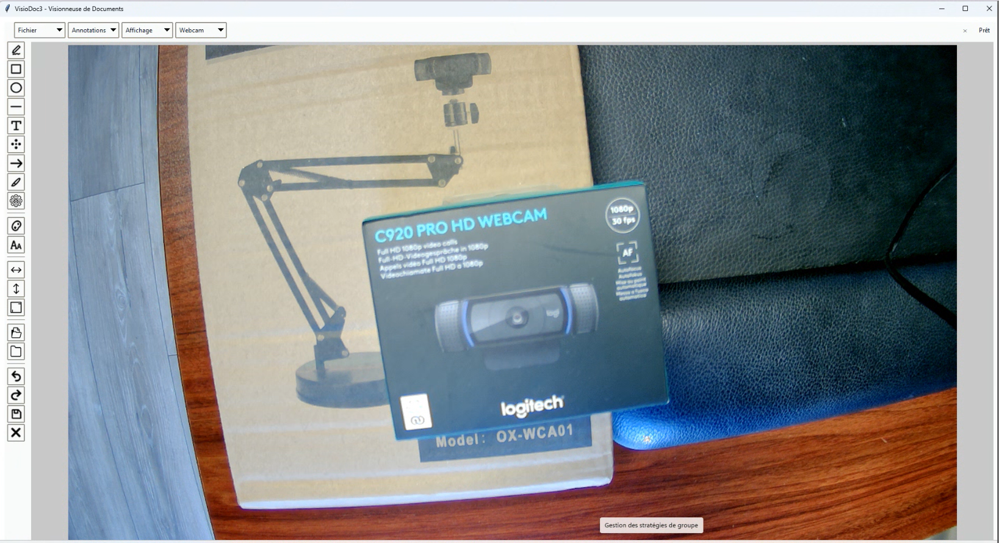
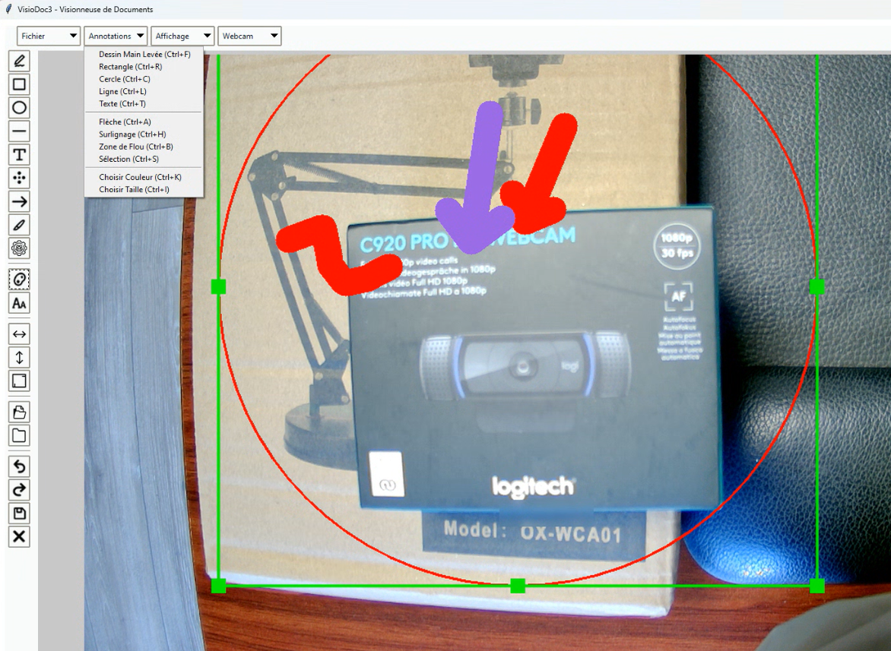
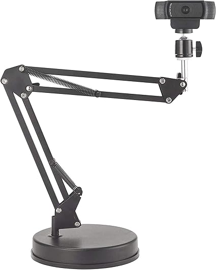

# VisioDoc3

VisioDoc3 est une application intuitive conçue pour la visualisation de flux vidéo en temps réel depuis votre webcam, avec des capacités d'annotation avancées. Que vous ayez besoin de mettre en évidence des détails, d'ajouter des notes ou de flouter des informations sensibles, VisioDoc3 offre une suite complète d'outils pour améliorer votre expérience de capture et de manipulation d'images.

## Fonctionnalités

*   Affichage du flux en temps réel de la webcam.
*   Outils d'annotation complets :
    *   Dessin à main levée
    *   Rectangles
    *   Cercles
    *   Lignes
    *   Texte
    *   Zones de flou
    *   Flèches
    *   Surlignages
*   Sélection, déplacement et redimensionnement des annotations.
*   Personnalisation de la couleur et de l'épaisseur des annotations.
*   Fonctionnalité de zoom et de panoramique.
*   Retournement horizontal et vertical de l'image.
*   Possibilité d'ouvrir et d'annoter des fichiers image (PNG, JPG, BMP, GIF) et des documents PDF.
*   Sauvegarde des images annotées au format PNG ou PDF.
*   Fonctionnalité Annuler/Rétablir pour les annotations.
*   Contrôle des paramètres de la caméra (luminosité, contraste, résolution).
*   Interface conviviale avec info-bulles et raccourcis clavier.

## Interface Hybride

VisioDoc3 propose une interface moderne avec une sidebar compacte et une barre d'outils supérieure pour une utilisation efficace de l'espace.

### Disposition de l'Interface

- **Barre d'outils supérieure** (menu horizontal) :
  - **Fichier** : Ouvrir, Sauvegarder, Fermer fichier, Quitter
  - **Annotations** : Outils de dessin (dessin libre, rectangle, cercle, ligne, texte, flou, flèche, surlignage, sélection)
  - **Affichage** : Contrôles de zoom, Retourner, Plein écran, Paramètres
  - **Webcam** : Menu déroulant de sélection de caméra
  - **Indicateur d'état** : Affiche l'état actuel à droite

- **Sidebar gauche** (panel d'icônes compact 48px) :
  - Outils de dessin avec infobulles (9 boutons)
  - Sélection couleur/taille (2 boutons)
  - Actions : Annuler, Rétablir, Sauvegarder, Effacer (4 boutons)
  - Contrôles affichage : Retourner H/V, Plein écran (3 boutons)
  - Contrôles fichiers : Ouvrir, Fermer (2 boutons)

- **Zone d'affichage** : Espace central affichant le flux webcam avec annotations superposées.

### Raccourcis Clavier

| Raccourci | Action |
|-----------|--------|
| Ctrl+O | Ouvrir un fichier |
| Ctrl+Shift+S | Sauvegarder l'image |
| Ctrl+F | Outil dessin libre |
| Ctrl+R | Outil rectangle |
| Ctrl+C | Outil cercle |
| Ctrl+L | Outil ligne |
| Ctrl+T | Outil texte |
| Ctrl+A | Outil flèche |
| Ctrl+H | Outil surlignage |
| Ctrl+B | Outil flou |
| Ctrl+S | Outil sélection |
| Ctrl+Z | Annuler |
| Ctrl+Y | Rétablir |
| Ctrl++ | Zoom avant |
| Ctrl+- | Zoom arrière |
| F11 | Basculer plein écran |

### Capture d'écran

## Manuel d'Utilisation

Pour des instructions détaillées sur l'utilisation de VisioDoc3 et ses diverses fonctionnalités, veuillez consulter le [Manuel d'Utilisation](MANUAL.md).

## Compilation

Pour des instructions sur la compilation de VisioDoc3 en un exécutable pour Windows et Linux, veuillez consulter le [Guide de Compilation](COMPILATION.md).

### GitHub Actions (Recommandé)

Les exécutables Windows sont automatiquement construits via GitHub Actions. Consultez l'[onglet Actions](https://github.com/moravel/VisioDoc3/actions) pour voir les builds après chaque push vers la branche principale.

## Technologies Utilisées

*   Python
*   Tkinter (pour l'interface graphique)
*   OpenCV (pour le traitement vidéo et le dessin)
*   Pillow (Fork de PIL - pour la manipulation d'images)
*   PyMuPDF (pour la gestion des PDF)
*   PyGrabber (spécifique à Windows pour l'énumération des caméras)
*   PyInstaller (pour la création d'exécutables)

## Licence

**Licence copyleft (GPLv3)** - Toute œuvre dérivée doit également être open source sous la même licence.

Ce projet est licencié sous la GNU General Public License v3.0 - voir le fichier [LICENSE](LICENSE) pour plus de détails.
